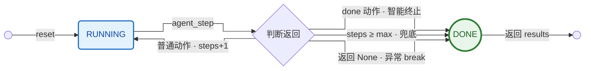

# lesson6 答疑：Agent 循环与状态管理

> 本文沉淀学完 lesson6（agent loop）后的核心理解与 3 个问题：
> 1. 本节课到底要"理解"什么？（§1）
> 2. lesson6 的状态机：一个最小 FSM 入门案例（§2）
> 3. 怎么理解 Agent 的状态管理？（§3）
>
> 主线：**Agent = 循环 + 状态**。lesson6 用最小代码立起"观察→决策→行动不断重复 + 带状态"的骨架；但这一版的"连续性"刻意很弱（只把 `steps`/`done` 喂回 prompt），真正的历史回灌留到 lesson7（memory）。
>
> 怎么读：只看结论翻文末「§4 速查表」；要原理读对应小节。
> 配套：状态机（FSM）本身是什么、怎么应用、怎么落到业务，见 `06c-状态机-从概念到订单流转设计.md`。
> 代码锚点：`agent/agent.py:340 agent_step` / `agent/agent.py:411 run_loop` / `agent/state.py AgentState`。

---

## 0 主线

```
聊天机器人：响应一次 → 停。
Agent：观察 → 决策 → 行动 → 重复，直到终止。  ← 多了"循环"和"状态"两样东西

lesson6 立的骨架：
  run_loop ── while not done and steps < max_steps ──> 反复调用 agent_step
                                                          │
                          每步：读状态(steps/done) → 拼 prompt → 问 LLM → 拿到 action → 改状态
                                                          │
                          终止：LLM 发 "done" 动作  或  steps 撞上 max_steps
```

关键：循环带来"多步行为"，状态带来"连续性"——但这一版连续性很弱，见 §1.3。

---

## 1 本节课的重点理解内容

### 1.1 主命题：Agent = 循环 + 状态

chatbot 响应一次就停；agent 是 `observe → decide → act` 不断重复，且带 state。文档原话："Agent 不是一个聪明的 prompt，它是一个**带状态的循环**。神奇之处不在 prompt 里——而在那个不断重复的循环。"

### 1.2 三个新概念

| 概念 | 是什么 | 代码落点 |
|---|---|---|
| Agent Loop（循环） | observe→decide→act 重复 | `run_loop` (agent.py:411) |
| State Transitions（状态转移） | 状态随每步变化（steps/done） | `AgentState`（state.py） |
| Termination（终止条件） | 何时停：`done` 信号 / `max_steps` | `while not done and steps<max` |

### 1.3 真正要 get 的点：这一版的"连续性"其实很弱（刻意的）

文档高调说"状态带来连续性"，但**最小实现的连续性几乎是空的**，这是有意为之：

1. `run_loop` 每一步都把**同一个初始 `user_input`** 传给 `agent_step`（不变）；
2. 喂进 prompt 的"状态"只有 `steps` 和 `done` **两个值**——**前几步的 action 结果（`results`）根本没回灌进 prompt**；
3. `temperature=0.0` → LLM 每轮看到的唯一变量就是 `steps` 计数器。

→ 所以文档明说"前几轮出现重复是正常的"。把上一步结果喂回去 = **lesson7（memory）才补**。lesson6 只立"重复行动 + 不跑飞"这副骨架。

### 1.4 两道终止闸

`while not self.state.done and self.state.steps < max_steps`：

- **`done` 动作**：LLM 主动输出 `{"action":"done"}` → `run_loop` 调 `mark_done()` 置 `done=True`（智能终止）。
- **`max_steps`**：安全阀，防 LLM 永远不发 done 时无限循环（兜底终止）。

缺一不可：只有前者，模型不发 done 就跑飞；只有后者，每次都要跑满 max_steps。

---

## 2 lesson6 的状态机：一个最小 FSM 入门案例

lesson6 里就藏着一台**最小的状态机**——只有两个状态：「运行中」(`RUNNING`) 和「结束」(`DONE`)。你做订单系统时处理的那种「状态流转」，这里就是最小一版：状态少到只有两个、规则简单到几行 `while`。拿它入门最省力——不用先啃理论符号，直接看代码怎么转。

> 先点破位置：状态机在 `run_loop`（控制流），**不在** `AgentState`。`AgentState` 只是这台机读写的内存（变量容器），本身不是状态机——为什么，见 §2.4。

### 2.1 这台机长什么样（状态图）

从上往下读这一条主干线即可：

```
         ●  开始
         │
         │  reset()  →  进入 RUNNING
         ▼
   ┌───────────┐
   │  RUNNING  │  ⟲ 自转：每来一个「普通动作」(analyze / research …) → steps += 1，留在 RUNNING
   └───────────┘
         │
         │  以下任一成立 → 转入 DONE：
         │    ① LLM 发出 done 动作        →  智能终止
         │    ② steps ≥ max_steps         →  兜底终止（默认 max_steps = 5）
         │    ③ agent_step 返回 None      →  连续 3 次解析失败，break
         ▼
   ┌───────────┐
   │   DONE    │  ●  终态：run_loop 结束，返回 results
   └───────────┘
```

<details><summary>同一张图的 Mermaid 版（查看器支持 Mermaid 时渲染成真图）</summary>



</details>

两个状态：`RUNNING`（在干活）、`DONE`（停机）。进 `run_loop` 先 `reset()` 回到 `RUNNING`，之后每一步要么**自转**（继续 RUNNING），要么落入 `DONE`。注意：每次 `agent_step` 成功取到动作都会 `steps += 1`（agent.py:406），所以即便一直发普通动作，`steps` 也会逼近 `max_steps` 被兜底停机。

### 2.2（选读）对一下学术定义 / Java 八股

想把这台机和学校"自动机理论"的五元组 `(Q, Σ, δ, q₀, F)` 对号、或对一下 Java 八股里的「状态机」？**入门可跳过**——对照表挪到了**文末「附录 A」**，好奇再翻，免得符号挡在入门正文里。

### 2.3 状态怎么变：一张"什么时候跳到哪"的规则表（核心）

状态机的核心就一件事：**现在是什么状态 + 发生了什么 → 跳到哪个状态**。lesson6 把这套规则全写在 `run_loop` 这几行：

```python
while not self.state.done and self.state.steps < max_steps:   # 守卫：仍在 RUNNING？
    action = self.agent_step(user_input)                       # 取事件（内部 steps += 1）
    if action:
        results.append(action)
        if action.get("action") == "done":                     # 事件 = done 动作
            self.state.mark_done()                             # 转移: RUNNING → DONE
    else:                                                       # 事件 = None（连续解析失败）
        break                                                   # 转移: RUNNING → DONE
```

读成转移表：

| 当前态 | 事件（agent_step 返回） | → 新态 | 怎么发生 |
|---|---|---|---|
| RUNNING | 普通动作（analyze/research…） | RUNNING | 不置 done，`steps+1`，下一轮 `while` 仍真 |
| RUNNING | `{"action":"done"}` | **DONE** | `mark_done()` → `done=True`，`while` 转假 |
| RUNNING | `None`（重试 3 次仍解析失败） | **DONE** | `else: break` 直接跳出 |
| RUNNING | —（`steps` 已撞 `max_steps`） | **DONE** | `while` 的 `steps<max` 转假 |

**三条入 DONE 的路**：智能终止（done 动作）、异常终止（解析失败 break）、兜底终止（撞 max_steps）。这是 §1.4「两道终止闸」的完整版——其实是三道，第三道是解析失败那扇暗门。

### 2.4 关键设计：机与数据分离

这台机最值得学的一点：**状态机（`run_loop`）和它的状态数据（`AgentState`）是分开的两样东西。**

- `run_loop` 是**机**：定义有哪些状态、怎么转、何时停——"怎么转"。
- `AgentState` 是**内存**：存 `steps` / `done` 的当前值——"转到哪了"。

`AgentState` 本身**不是**状态机：它持有的 `steps` 是无界整数（0,1,2…）不是有限状态，`increment_step()` 只是 `steps += 1` 没有转移规则，它同时握着多个独立变量、不"处于"某个状态。它只是这台机读写的寄存器（存当前值）。

为什么这么分：**机（逻辑）不变，数据（状态）可被检视 / 打印 / 重置**。你能 `print(state)` 看现在转到第几步，能 `reset()` 一键回初始态，而不必碰控制流。这正呼应 PHILOSOPHY「没有魔法」：状态是摊开的变量，不藏在对话历史里。

### 2.5 和 06c 订单状态机的唯一差别

lesson6 这台和你熟的 06c 订单状态机**长得一模一样**（都是有限状态 + 受约束的转移 + 终态），只差一处：**转移规则由谁定**。

| | 订单状态机（06c） | lesson6 这台 |
|---|---|---|
| 转移规则怎么来 | 程序员**硬编码**转移表 | 一半硬编码（while/if），一半由 **LLM 决定**发不发 done |
| 可验证性 | 规则能穷举验证 | 含 LLM 决策，不可穷举 |

lesson6 这台还是"半硬编码"——LLM 只决定发不发 `done`，框架（while/if）仍兜着底。等后续课把越来越多的转移规则交给 LLM，就从"传统状态机程序"滑向"真正的 agent"。这是这个入门案例埋的引子。

---

## 3 怎么理解 Agent 的状态管理

`state.py` 文件头那句是设计哲学（呼应 PHILOSOPHY「没有魔法」）：

> 状态是显式的、可检视的、可修改的。它不会隐藏在对话历史里，也不会藏在某种神秘的上下文中。

### 3.1 显式 vs 隐式（藏在对话历史）

- **隐式**：很多框架把状态藏在 conversation history / context 里——把所有历史拼进 prompt，让 LLM"自己记"。你看不见、改不了。
- **本课（显式）**：状态是一个独立 Python 对象，字段一眼看穿，能 `print`、能断点、能手改。**LLM 不负责记状态，代码负责记状态。**

### 3.2 状态管理三动作：读 / 写 / 重置

| 动作 | 方法 | 在循环里何时发生 |
|---|---|---|
| 读 | `to_dict()` → 注入 prompt | 每步开头，让 LLM 看见 steps/done（**状态影响决策的唯一通道**） |
| 写 | `increment_step()` / `mark_done()` | 每步 +1；收到 `done` 动作时置真 |
| 重置 | `reset()` | 新任务开始（`run_loop` 第一行） |

### 3.3 一个易忽略点：预留但未用的字段

`AgentState.__init__` 里有 **4 个字段**，但 lesson6 的 `agent_step`/`run_loop` **只读写 `steps` 和 `done`**——`current_plan` / `last_action` 是上游为后续课**预埋**的（注释写明：07 记忆 / 08 规划 / 09 执行 / 10 依赖）。所以本课真正"活"的状态只有两个：**步数计数器 + 完成标志**。

---

## 4 速查表

| 问题 | 一句话结论 |
|---|---|
| 本课要 get 什么 | Agent = 循环 + 状态；循环带多步行为，状态带连续性 |
| 为什么前几轮重复 | 每步喂同一 input，状态只回灌 steps/done，temp=0 → 输入几乎没变（刻意，lesson7 补） |
| 两道终止闸 | `done` 动作（智能）+ `max_steps`（兜底），缺一不可 |
| AgentState 是 FSM 吗 | 不是，是"显式状态容器"（数据对象） |
| 那台 FSM 在哪 | 在 `run_loop`（两态 RUNNING/DONE）；机与数据分离 |
| 状态管理本质 | 显式管理：读(to_dict→prompt)/写(increment/mark_done)/重置(reset) |
| 真正活跃的状态 | 只有 `steps` + `done`；`current_plan`/`last_action` 是后续课预埋 |

---

## 附录 A：五元组 ↔ lesson6 代码（选读）

给想把 §2 这台机和学校"自动机理论"五元组 `(Q, Σ, δ, q₀, F)` 对号入座、或对一下 Java 八股「状态机」的人——纯理论补充，跳过不影响用 lesson6：

| FSM 要素 | 形式定义含义 | lesson6 里是什么 | 代码落点 |
|---|---|---|---|
| **Q** 状态集 | 有限个命名状态 | `{RUNNING, DONE}` | `state.done` 真/假两态 |
| **Σ** 事件集 | 触发转移的输入 | `agent_step` 的返回值 | done 动作 / 普通动作 / None |
| **δ** 转移函数 | (状态×事件)→新状态 | `while` 守卫 + 里面的 `if` | `run_loop` agent.py:425-435 |
| **q₀** 初始态 | 开机状态 | `RUNNING` | `reset()` agent.py:422 |
| **F** 终态 | 接受/停机状态 | `{DONE}` | `mark_done()` agent.py:433 |

信源：Sipser《Introduction to the Theory of Computation》第 1 章、Hopcroft–Ullman《Introduction to Automata Theory, Languages, and Computation》；详见 `06c-状态机-从概念到订单流转设计.md` §1。

课本里那五个唬人的符号，在 lesson6 里每个都能用手指点到具体哪一行代码——符号吓人，东西你早会。
